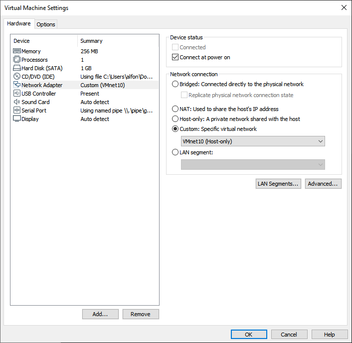

## Laboratorio Redes de Computadoras 1
## Practica 1
## Luis Alfonso Melgar Arizpe - 201602820

---

# Manual de configuracion

## Configuracion de la topologia de Red
La topologia de red utilizada fue la siguiente: 

Esta topologia nos permite conectar dos grupos de computadoras que comparten la misma red por medio del Switch. Estos switch se conectan al Router el cual permite que la red de la izquierda pueda encontrar el grupo de red de la derecha, y viceversa. De esta manera se tiene una comunicacion a ambos lados entre los grupos de red.

## Configuracion de cada componente
-- **Router 3725 (R1)**
Para configurar el router es necesario ingresar a la configuracion de cada una de las terminales y asignarles la Direccion de Red y una IP.

-- **VPC**
Para configurar la VPC es necesario ingresar a la configuracion y configurar la red de la computadora.
* PC2

&nbsp;&nbsp;&nbsp;&nbsp;&nbsp;&nbsp;&nbsp;&nbsp;&nbsp;&nbsp;

* PC3

&nbsp;&nbsp;&nbsp;&nbsp;&nbsp;&nbsp;&nbsp;&nbsp;&nbsp;&nbsp;

* PC4

&nbsp;&nbsp;&nbsp;&nbsp;&nbsp;&nbsp;&nbsp;&nbsp;&nbsp;&nbsp;

- **VMWare Virtual Machine con TinyCoreLinux (TinyCoreLinux-1)**

Para configurar la red de una maquina virtual en VMWare primero se debe asignar un grupo de VMnets para el uso de GNS3 desde la configuracion de este.

Luego se le asigna una de estas VMnets a la maquina virtual en VMWare.

Para configurar la red de TinyCoreLinux podemos entrar a *Panel de Control -> Red* y realizar la configuracion.

## Comunicacion entre las computadoras
Luego de configurar todos los componentes podemos realizar pruebas de comunicacion entre las 4 computadoras utilizando el comando **ping *IP***.

* PC2 (192.168.10.30)

&nbsp;&nbsp;&nbsp;&nbsp;&nbsp;&nbsp;&nbsp;&nbsp;&nbsp;&nbsp;

* PC3 (192.168.12.15)

&nbsp;&nbsp;&nbsp;&nbsp;&nbsp;&nbsp;&nbsp;&nbsp;&nbsp;&nbsp;

* PC4 (192.168.12.30)

&nbsp;&nbsp;&nbsp;&nbsp;&nbsp;&nbsp;&nbsp;&nbsp;&nbsp;&nbsp;

* TinyCoreLinux-1 (192.168.10.15)

&nbsp;&nbsp;&nbsp;&nbsp;&nbsp;&nbsp;&nbsp;&nbsp;&nbsp;&nbsp;

## Glosario
1. **IP** : (Internet Protocol) Numero que identifica de forma unica una intefaz en una red.
2. **VPCS**: (Virtual PC Simulator) En GNS3 VPCS es un simulador de maquinas virtuales livianas, orientadas principalmente a configuraciones de red.  
3. **Switch** : Dispositivo digital que interconexiona equipos en red. Opera en la capa de enlace de datos del modelo OSI.
4. **Router** : Dispositivo digital que se encarga de establecer rutas de destino para los paquetes dentro de una red. 
5. **Mascara de Red** : Combinacion de bits que delimita el ambito de una red. Indica a los dispositivos que parte de la IP es el numero de red, y cual es el identificador del host. 
6. **Direccion de Red** : La direccion de red se utiliza para hacer referencia a una red. Se utiliza la direccion mas baja para la direccion de red, por ejemplo en IPV4 es la direccion 0.
7. **Topologia de Red** : Mapeo fisico o logico de una red. En el se pueden ver los componentes de red y la forma en que estan conectados entre ellos. 
8. **Interfaz** : Componente de hardware que conecta una computadora a una red.  
9. **Virtualizacion** : Creacion y ejecucion de una version virtual de un recurso tecnologico (Sistema Operativo, Dispositivos, Recursos de Red, etc.) a travez de un software de Virtualizacion.
10. **Software de Simulacion** : Un Software de simulacion permite modelar sistemas de diferentes tipos y realizar una simulacion en tiempo real con condiciones iguales o muy similares a un sistema fisico. 
